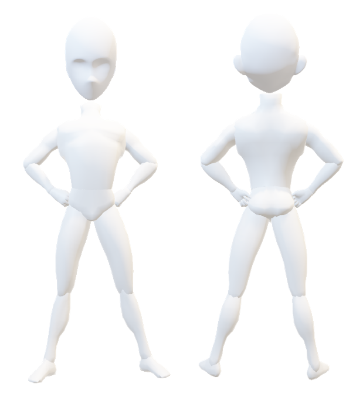

# Derma Avatar Photo App

The Derma Avatar Photo App EM allows survey takers to take photos on their phone (or
select existing files) and link the uploaded photo to the selected image map in the
survey. This EM extends functionality of the ImageMap EM by linking the image part
selection with a file upload field (rather than the checkbox field).

##Prerequisites

* ImageMap EM installed and enabled in your project
* Currently only supports a single image map in the project

##Configuration
For this configuration example, we will be utilizing the DERM_PHOTO_BODY image

1. Add a checkbox field to your survey with these choice selections. These choices
correspond to the 7 selectable regions in the DERM_PHOTO_BODY image map and is the
key defined in the HTML map file.

```
f01, Face
f02, Chest
f03, Right Arm
f04, Left Arm
f05, Right Leg
f06, Left Leg
r02, Back
```

2. Add this Action Tag to the checkbox field
```
@IMAGEMAP=DERM_PHOTO_BODY
```
3. For each of those select options, create a File Upload field with the variable name that corresponds to the coded value.
Set the Action-Tag to @HIDDEN-SURVEY

For this example, there will be 7 File Upload fields named f01, f02, etc.

